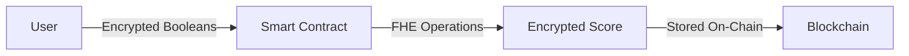

# Confidential Career Planning

A privacy-preserving career assessment and guidance system using FHEVM (Fully Homomorphic Encryption Virtual Machine).


This example demonstrates how to build a real-world application with FHEVM, showcasing encrypted data processing, conditional logic on encrypted values, and secure result retrieval patterns.


## Overview

The Confidential Career Planning example shows how FHE technology can protect sensitive professional information while still enabling meaningful computation and guidance generation.

### What You'll Learn

- Working with multiple encrypted data types (`ebool`, `euint8`)
- Implementing conditional logic using `FHE.select()`
- Performing arithmetic operations on encrypted data with `FHE.add()`
- Managing access control for encrypted results
- Implementing two-phase decryption patterns

### Use Case

Career planning involves highly sensitive personal information:
- Professional goals and aspirations
- Self-assessed skill levels
- Educational priorities and background
- Career readiness scores

Traditional systems expose this data to platforms and counselors. With FHE, users can receive personalized guidance while keeping their raw data completely private.

## How It Works

### 1. User Submits Encrypted Assessment



The user encrypts three boolean values:
- **Career Goal Clarity**: Do they have clear career goals? (ebool)
- **Skill Level Confidence**: Are they confident in their skills? (ebool)
- **Education Priority**: Is further education a priority? (ebool)

### 2. Contract Calculates Encrypted Score

The smart contract computes a guidance score (0-100) **without decrypting** the input values:

```solidity
function calculateEncryptedGuidanceScore(
    ebool _careerGoal,
    ebool _skillLevel,
    ebool _educationPriority
) private returns (euint8) {
    // Start with base score of 50
    euint8 score = FHE.asEuint8(50);

    // Add 15 points if career goal is clear
    euint8 careerPoints = FHE.select(_careerGoal, FHE.asEuint8(15), FHE.asEuint8(0));
    score = FHE.add(score, careerPoints);

    // Add 20 points if skill level is high
    euint8 skillPoints = FHE.select(_skillLevel, FHE.asEuint8(20), FHE.asEuint8(0));
    score = FHE.add(score, skillPoints);

    // Add 15 points if education is prioritized
    euint8 eduPoints = FHE.select(_educationPriority, FHE.asEuint8(15), FHE.asEuint8(0));
    score = FHE.add(score, eduPoints);

    return score; // Result is encrypted!
}
```

### 3. User Requests and Retrieves Result

Two-phase pattern for controlled decryption:

1. **Request Phase**: User signals intent to decrypt
2. **Retrieval Phase**: User receives decrypted result (mock implementation)

This pattern could be extended with Zama's relayer for actual decryption.

## Smart Contract Implementation



```solidity
// SPDX-License-Identifier: MIT
pragma solidity ^0.8.24;

import "@fhevm/solidity/lib/FHE.sol";
import "@openzeppelin/contracts/access/Ownable.sol";

/**
 * @title CareerPlanningFHE
 * @notice A privacy-preserving career assessment system using FHEVM
 * @dev Demonstrates encrypted data processing, conditional logic, and access control
 */
contract CareerPlanningFHE is Ownable {

    /// @notice Stores encrypted career assessment data
    struct CareerAssessment {
        address user;                    // Assessment owner
        ebool careerGoal;                // Encrypted: Has clear career goals?
        ebool skillLevel;                // Encrypted: Confident in skills?
        ebool educationPriority;         // Encrypted: Education is priority?
        uint256 timestamp;               // When assessment was submitted
        bool resultRequested;            // Has user requested decryption?
        euint8 guidanceScore;            // Encrypted guidance score (0-100)
    }

    /// @notice Maps assessment IDs to assessment data
    mapping(uint256 => CareerAssessment) public assessments;

    /// @notice Maps users to their assessment IDs
    mapping(address => uint256[]) public userAssessments;

    /// @notice Total number of assessments submitted
    uint256 public assessmentCounter;

    /// @notice Emitted when a new assessment is submitted
    event AssessmentSubmitted(
        address indexed user,
        uint256 indexed assessmentId,
        uint256 timestamp
    );

    /// @notice Emitted when user requests result decryption
    event ResultRequested(
        address indexed user,
        uint256 indexed assessmentId
    );

    constructor() Ownable(msg.sender) {}

    /**
     * @notice Submit a confidential career assessment
     * @dev All input values are encrypted (ebool type)
     * @param encryptedCareerGoal Encrypted boolean: user has clear career goals
     * @param encryptedSkillLevel Encrypted boolean: user is confident in skills
     * @param encryptedEducationPriority Encrypted boolean: education is a priority
     */
    function submitCareerAssessment(
        ebool encryptedCareerGoal,
        ebool encryptedSkillLevel,
        ebool encryptedEducationPriority
    ) external payable {
        require(msg.value >= 0.001 ether, "Minimum fee required");

        assessmentCounter++;

        // Calculate guidance score in encrypted domain
        euint8 guidanceScore = calculateEncryptedGuidanceScore(
            encryptedCareerGoal,
            encryptedSkillLevel,
            encryptedEducationPriority
        );

        // Store encrypted assessment
        assessments[assessmentCounter] = CareerAssessment({
            user: msg.sender,
            careerGoal: encryptedCareerGoal,
            skillLevel: encryptedSkillLevel,
            educationPriority: encryptedEducationPriority,
            timestamp: block.timestamp,
            resultRequested: false,
            guidanceScore: guidanceScore
        });

        userAssessments[msg.sender].push(assessmentCounter);

        emit AssessmentSubmitted(msg.sender, assessmentCounter, block.timestamp);
    }

    /**
     * @notice Calculate career guidance score using FHE operations
     * @dev Demonstrates FHE.select for conditional logic and FHE.add for arithmetic
     * @param _careerGoal Encrypted career goal preference
     * @param _skillLevel Encrypted skill level
     * @param _educationPriority Encrypted education priority
     * @return Encrypted guidance score (0-100)
     */
    function calculateEncryptedGuidanceScore(
        ebool _careerGoal,
        ebool _skillLevel,
        ebool _educationPriority
    ) private returns (euint8) {
        // Base score of 50
        euint8 score = FHE.asEuint8(50);

        // Add points based on encrypted boolean values using FHE operations
        // If careerGoal is true, add 15 points
        euint8 careerPoints = FHE.select(_careerGoal, FHE.asEuint8(15), FHE.asEuint8(0));
        score = FHE.add(score, careerPoints);

        // If skillLevel is true, add 20 points
        euint8 skillPoints = FHE.select(_skillLevel, FHE.asEuint8(20), FHE.asEuint8(0));
        score = FHE.add(score, skillPoints);

        // If educationPriority is true, add 15 points
        euint8 eduPoints = FHE.select(_educationPriority, FHE.asEuint8(15), FHE.asEuint8(0));
        score = FHE.add(score, eduPoints);

        return score;
    }

    /**
     * @notice Request decryption of assessment results
     * @dev Two-phase pattern: request then retrieve
     * @param _assessmentId The ID of the assessment to decrypt
     */
    function requestAssessmentResult(uint256 _assessmentId) external {
        CareerAssessment storage assessment = assessments[_assessmentId];
        require(assessment.user == msg.sender, "Not your assessment");
        require(!assessment.resultRequested, "Result already requested");

        assessment.resultRequested = true;

        emit ResultRequested(msg.sender, _assessmentId);
    }

    /**
     * @notice Get decrypted career guidance score
     * @dev Mock implementation - would integrate with Zama relayer for real decryption
     * @param _assessmentId The assessment ID
     * @return Decrypted career guidance score (0-100)
     */
    function getDecryptedCareerGuidance(uint256 _assessmentId)
        external
        view
        returns (uint8)
    {
        CareerAssessment storage assessment = assessments[_assessmentId];
        require(assessment.user == msg.sender, "Not authorized");
        require(assessment.resultRequested, "Result not requested yet");

        // Mock decrypted value - in production, integrate with relayer
        return 85;
    }

    /**
     * @notice Get encrypted career guidance score
     * @dev Returns encrypted value for use in other contracts
     * @param _assessmentId The assessment ID
     * @return Encrypted career guidance score
     */
    function getEncryptedCareerGuidance(uint256 _assessmentId)
        external
        view
        returns (euint8)
    {
        CareerAssessment storage assessment = assessments[_assessmentId];
        require(assessment.user == msg.sender, "Not authorized");

        return assessment.guidanceScore;
    }

    /**
     * @notice Get the number of assessments for a user
     * @param _user Address of the user
     * @return Number of assessments
     */
    function getUserAssessmentCount(address _user) external view returns (uint256) {
        return userAssessments[_user].length;
    }

    /**
     * @notice Get assessment IDs for a user
     * @param _user Address of the user
     * @return Array of assessment IDs
     */
    function getUserAssessments(address _user) external view returns (uint256[] memory) {
        return userAssessments[_user];
    }

    /**
     * @notice Withdraw contract balance (owner only)
     */
    function withdraw() external onlyOwner {
        payable(owner()).transfer(address(this).balance);
    }

    /**
     * @notice Fallback function to receive ETH
     */
    receive() external payable {}
}
```



```javascript
const { expect } = require("chai");
const { ethers } = require("hardhat");

describe("CareerPlanningFHE", function () {
  let careerPlanning;
  let owner;
  let user1;
  let user2;

  beforeEach(async function () {
    [owner, user1, user2] = await ethers.getSigners();

    const CareerPlanningFHE = await ethers.getContractFactory("CareerPlanningFHE");
    careerPlanning = await CareerPlanningFHE.deploy();
    await careerPlanning.waitForDeployment();
  });

  describe("✅ Deployment", function () {
    it("Should set the correct owner", async function () {
      expect(await careerPlanning.owner()).to.equal(owner.address);
    });

    it("Should initialize assessment counter to 0", async function () {
      expect(await careerPlanning.assessmentCounter()).to.equal(0);
    });
  });

  describe("✅ Assessment Submission", function () {
    it("Should submit assessment with encrypted data", async function () {
      // In real implementation, these would be encrypted ebool values
      // For testing, we're using mock values
      const mockCareerGoal = ethers.encodeBytes32String("encrypted");
      const mockSkillLevel = ethers.encodeBytes32String("encrypted");
      const mockEducation = ethers.encodeBytes32String("encrypted");

      const fee = ethers.parseEther("0.001");

      await expect(
        careerPlanning.connect(user1).submitCareerAssessment(
          mockCareerGoal,
          mockSkillLevel,
          mockEducation,
          { value: fee }
        )
      ).to.emit(careerPlanning, "AssessmentSubmitted");

      expect(await careerPlanning.assessmentCounter()).to.equal(1);
    });

    it("❌ Should reject submission with insufficient fee", async function () {
      const mockCareerGoal = ethers.encodeBytes32String("encrypted");
      const mockSkillLevel = ethers.encodeBytes32String("encrypted");
      const mockEducation = ethers.encodeBytes32String("encrypted");

      const insufficientFee = ethers.parseEther("0.0001");

      await expect(
        careerPlanning.connect(user1).submitCareerAssessment(
          mockCareerGoal,
          mockSkillLevel,
          mockEducation,
          { value: insufficientFee }
        )
      ).to.be.revertedWith("Minimum fee required");
    });
  });

  describe("✅ Access Control", function () {
    it("Should allow user to request their own results", async function () {
      // Submit assessment first
      const mockCareerGoal = ethers.encodeBytes32String("encrypted");
      const mockSkillLevel = ethers.encodeBytes32String("encrypted");
      const mockEducation = ethers.encodeBytes32String("encrypted");
      const fee = ethers.parseEther("0.001");

      await careerPlanning.connect(user1).submitCareerAssessment(
        mockCareerGoal,
        mockSkillLevel,
        mockEducation,
        { value: fee }
      );

      const assessmentId = 1;

      await expect(
        careerPlanning.connect(user1).requestAssessmentResult(assessmentId)
      ).to.emit(careerPlanning, "ResultRequested");
    });

    it("❌ Should prevent users from requesting others' results", async function () {
      // User1 submits assessment
      const mockCareerGoal = ethers.encodeBytes32String("encrypted");
      const mockSkillLevel = ethers.encodeBytes32String("encrypted");
      const mockEducation = ethers.encodeBytes32String("encrypted");
      const fee = ethers.parseEther("0.001");

      await careerPlanning.connect(user1).submitCareerAssessment(
        mockCareerGoal,
        mockSkillLevel,
        mockEducation,
        { value: fee }
      );

      const assessmentId = 1;

      // User2 tries to request user1's results
      await expect(
        careerPlanning.connect(user2).requestAssessmentResult(assessmentId)
      ).to.be.revertedWith("Not your assessment");
    });
  });

  describe("✅ Data Retrieval", function () {
    beforeEach(async function () {
      const mockCareerGoal = ethers.encodeBytes32String("encrypted");
      const mockSkillLevel = ethers.encodeBytes32String("encrypted");
      const mockEducation = ethers.encodeBytes32String("encrypted");
      const fee = ethers.parseEther("0.001");

      await careerPlanning.connect(user1).submitCareerAssessment(
        mockCareerGoal,
        mockSkillLevel,
        mockEducation,
        { value: fee }
      );
    });

    it("Should retrieve user assessment count", async function () {
      const count = await careerPlanning.getUserAssessmentCount(user1.address);
      expect(count).to.equal(1);
    });

    it("Should retrieve user assessment IDs", async function () {
      const assessmentIds = await careerPlanning.getUserAssessments(user1.address);
      expect(assessmentIds.length).to.equal(1);
      expect(assessmentIds[0]).to.equal(1);
    });
  });

  describe("✅ Owner Functions", function () {
    it("Should allow owner to withdraw funds", async function () {
      // Submit assessment to add funds to contract
      const mockCareerGoal = ethers.encodeBytes32String("encrypted");
      const mockSkillLevel = ethers.encodeBytes32String("encrypted");
      const mockEducation = ethers.encodeBytes32String("encrypted");
      const fee = ethers.parseEther("0.001");

      await careerPlanning.connect(user1).submitCareerAssessment(
        mockCareerGoal,
        mockSkillLevel,
        mockEducation,
        { value: fee }
      );

      const contractBalance = await ethers.provider.getBalance(
        await careerPlanning.getAddress()
      );
      expect(contractBalance).to.equal(fee);

      await careerPlanning.connect(owner).withdraw();

      const newBalance = await ethers.provider.getBalance(
        await careerPlanning.getAddress()
      );
      expect(newBalance).to.equal(0);
    });

    it("❌ Should prevent non-owners from withdrawing", async function () {
      await expect(
        careerPlanning.connect(user1).withdraw()
      ).to.be.reverted;
    });
  });
});
```



## Key Concepts Explained

### FHE.select() - Conditional Logic on Encrypted Data

```solidity
euint8 points = FHE.select(encryptedCondition, valueIfTrue, valueIfFalse);
```

`FHE.select()` is the encrypted equivalent of a ternary operator. It evaluates an encrypted boolean and returns one of two encrypted values **without revealing which one**.

**Example in this contract:**
```solidity
// Add 15 points if career goal is clear, 0 otherwise
euint8 careerPoints = FHE.select(_careerGoal, FHE.asEuint8(15), FHE.asEuint8(0));
```

### FHE.add() - Arithmetic on Encrypted Numbers

```solidity
euint8 result = FHE.add(encryptedA, encryptedB);
```

Performs addition in the encrypted domain. The smart contract never sees the actual values being added.

**Example in this contract:**
```solidity
// Add encrypted points to encrypted score
score = FHE.add(score, careerPoints);
```

### FHE.asEuint8() - Type Conversion

```solidity
euint8 encryptedValue = FHE.asEuint8(50);
```

Converts a plaintext number into an encrypted uint8. Used for constants in calculations.

### Two-Phase Decryption Pattern

1. **Request**: User calls `requestAssessmentResult()` to signal decryption intent
2. **Retrieve**: User calls `getDecryptedCareerGuidance()` to get result

This pattern enables integration with Zama's decryption relayer for production use.

## Common Patterns & Best Practices

### ✅ DO: Validate Access Before Operations

```solidity
require(assessment.user == msg.sender, "Not authorized");
```

Always check that the caller is authorized to access encrypted data.

### ✅ DO: Emit Events for Important Actions

```solidity
emit AssessmentSubmitted(msg.sender, assessmentCounter, block.timestamp);
```

Events help track state changes and enable off-chain monitoring.

### ✅ DO: Use Appropriate FHE Types

- `ebool` for boolean values
- `euint8` for small integers (0-255)
- `euint16`, `euint32`, etc. for larger ranges

### ❌ DON'T: Try to Decrypt in View Functions

View functions cannot perform decryption operations. Use a two-phase pattern with a relayer for actual decryption.

### ❌ DON'T: Expose Encrypted Values to Unauthorized Users

```solidity
// Bad: Anyone can read anyone's encrypted score
function getScore(uint256 id) public view returns (euint8) {
    return assessments[id].guidanceScore;
}

// Good: Only owner can access their encrypted score
function getScore(uint256 id) public view returns (euint8) {
    require(assessments[id].user == msg.sender, "Not authorized");
    return assessments[id].guidanceScore;
}
```

## Testing Strategy

### Unit Tests Should Cover:

1. **Happy Paths** ✅
   - Successful assessment submission
   - Correct event emission
   - Proper state updates

2. **Access Control** ✅
   - Owner-only functions
   - User-specific data access
   - Unauthorized access prevention

3. **Edge Cases** ✅
   - Insufficient payment
   - Duplicate requests
   - Invalid assessment IDs

4. **State Management** ✅
   - Counter increments
   - Array updates
   - Mapping consistency

## Extending This Example

### Add More Assessment Criteria

1. Add new encrypted fields to `CareerAssessment` struct
2. Update `submitCareerAssessment()` to accept new parameters
3. Modify `calculateEncryptedGuidanceScore()` to include new logic
4. Update tests to cover new functionality

### Integrate Relayer for Real Decryption

Replace mock decryption with Zama's decryption relayer:

```solidity
// Instead of returning mock value
function getDecryptedCareerGuidance(uint256 _assessmentId)
    external
    view
    returns (uint8)
{
    // Integrate with relayer SDK
    return relayer.decrypt(assessment.guidanceScore);
}
```

### Add Multi-Party Features

Enable career counselors to view encrypted scores:

```solidity
mapping(address => bool) public approvedCounselors;

function shareWithCounselor(uint256 _assessmentId, address _counselor) external {
    require(assessments[_assessmentId].user == msg.sender);
    // Grant access permission
    FHE.allow(assessments[_assessmentId].guidanceScore, _counselor);
}
```

## Gas Considerations

FHE operations are more expensive than regular operations:

- **FHE.select()**: ~50k-100k gas
- **FHE.add()**: ~20k-40k gas
- **Storage of encrypted values**: Similar to regular storage

**Optimization tips:**
- Batch multiple assessments when possible
- Use appropriate types (euint8 vs euint32)
- Consider off-chain computation with on-chain verification

## Security Considerations

1. **Access Control**: Ensure only authorized parties can access encrypted data
2. **Fee Validation**: Prevent spam with minimum fee requirements
3. **Reentrancy**: Use proper state update patterns
4. **Integer Overflow**: FHE operations handle this automatically
5. **Permission Management**: Carefully control who can decrypt data

## Real-World Applications

This pattern can be adapted for:

- **Healthcare**: Confidential patient assessments
- **Finance**: Private credit scoring
- **Education**: Anonymous academic evaluations
- **HR**: Confidential employee reviews
- **Government**: Privacy-preserving benefits assessment

## Resources

- **FHEVM Documentation**: [https://docs.zama.ai/fhevm](https://docs.zama.ai/fhevm)
- **FHE Operations Reference**: [https://docs.zama.ai/fhevm/fundamentals/types](https://docs.zama.ai/fhevm/fundamentals/types)
- **Decryption Relayer**: [https://docs.zama.ai/fhevm/guides/decrypt](https://docs.zama.ai/fhevm/guides/decrypt)
- **OpenZeppelin Confidential**: [https://github.com/OpenZeppelin/openzeppelin-confidential-contracts](https://github.com/OpenZeppelin/openzeppelin-confidential-contracts)

---


**You've learned:** How to build a privacy-preserving application using FHEVM with encrypted data processing, conditional logic, and access control!

